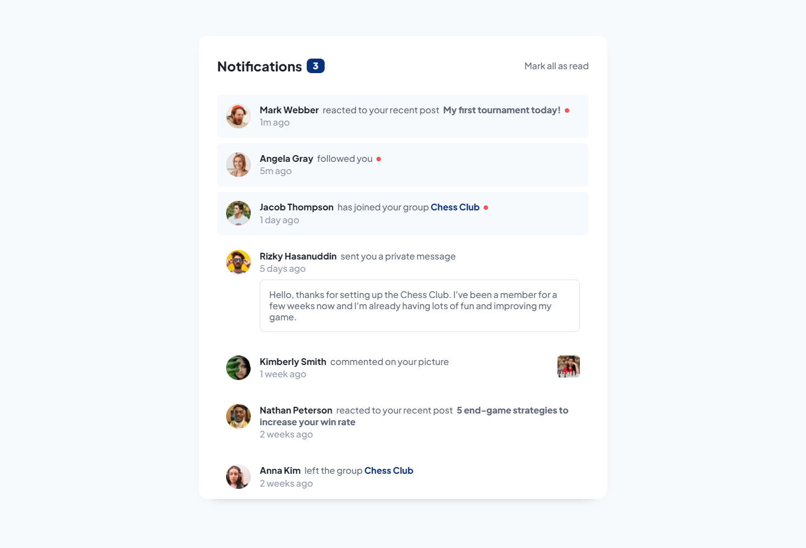

# Frontend Mentor - Notifications page solution

This is a solution to the [Notifications page challenge on Frontend Mentor](https://www.frontendmentor.io/challenges/notifications-page-DqK5QAmKbC). Frontend Mentor challenges help you improve your coding skills by building realistic projects. 

## Table of contents

- [Overview](#overview)
  - [The challenge](#the-challenge)
  - [Screenshot](#screenshot)
  - [Links](#links)
- [My process](#my-process)
  - [Built with](#built-with)
  - [What I learned](#what-i-learned)
  - [Continued development](#continued-development)
  - [Useful resources](#useful-resources)
- [Author](#author)

## Overview

### The challenge

Users should be able to:

- Distinguish between "unread" and "read" notifications
- Select "Mark all as read" to toggle the visual state of the unread notifications and set the number of unread messages to zero
- View the optimal layout for the interface depending on their device's screen size
- See hover and focus states for all interactive elements on the page

### Screenshot

### Links

- HTML Solution URL: [HTML](https://github.com/JustANipple/notifications-page/blob/master/index.html)
- SCSS Solution URL: [SCSS](https://github.com/JustANipple/notifications-page/blob/master/styles/main.scss)
- JS Solution URL: [JS](https://github.com/JustANipple/notifications-page/blob/master/scripts/script.js)
- Live Site URL: [LIVE](https://justanipple.github.io/notifications-page/)

## My process

### Built with

- Semantic HTML5 markup
- Flexbox
- CSS Grid
- Mobile-first workflow
- SCSS
- JavaScript

### What I learned

I tried to use SCSS variables this time and discovered that i can't access them anywhere unless i import the SCSS on the sheet where i need variables using "@use"

### Continued development

I need to focus on mixins and web components to use less code. In this particular challenge i could've repeated the notification element just as many times as needed, but instead i made a long HTML that repeats himself

### Useful resources

- [SCSS variables](https://stackoverflow.com/questions/67602149/in-a-partial-sass-file-how-can-i-use-a-variable-defined-in-the-parent) - This has a clear explanation on how the "@use" rule works to make use of SCSS variables

## Author

- Frontend Mentor - [@JustANipple](https://www.frontendmentor.io/profile/JustANipple)